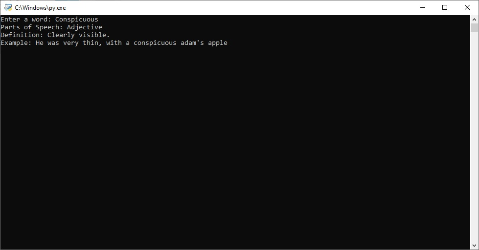

# Google Dictionary CLI

Google dictionary is a simple command line interface tool that uses python's `requests` library to parse the data of a word and shows the the meaning of that word with example.

#### Setup

Simply run the following command to install requests and just double click the script and enter a word that you'd like to see the meaning of.

`pip install requests`

## Example

